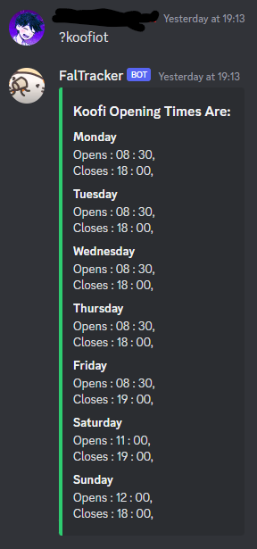

# FalTracker


Fal tracker is a bot that provides **up-to-date infomation on service times** around Penryn and Falmouth campus.

Faltracker scrapes Falmouth Uni's [Service Status & Opening Times](https://fxplus.ac.uk/uncategorised/service-status-opening-times/) page. Its uses this site to give the most reliable data possible. On that site, opening times for each service is stored and displayed. However, it can be cumberson to use this page.

OpenBrowser --> Go to page --> Find Drop down --> Open List --> Find Service --> Find Day--> Check Time

Faltracker streamlines this process

Open Discord --> Type Command

By typing in a commands, such as ```?koofi``` to see if koofi is open or ```?shopOt``` to see what times of the week campus shop is open, Faltracker will respond with a formatted message containing the answer. Such as,

## Call when Service is Open/Closed
<details><summary>Command Examples</summary>


</details>

## Call for Service Openening Times
<details><summary>Command Examples</summary>

</details>


## All Commands

Faltracker currently contains 24 command calls for services, involving 10 establishments between both campuses.

```
Commands:
  amata             Shows whether or not Amata Cafe is open
  amataOt           Shows the opening times for Amata Cafe
  esi               Shows whether or not esiCafe is open
  esiOt             Shows the opening times for esiCafe
  falmouthShop      Shows whether or not Falmouth Campus Art Shop is open
  falmouthShopOt    Falmouth Campus Art Shop
  fox               Shows whether or not Fox Cafe is open
  foxOt             Shows the opening times for the Fox Cafe
  gym               Shows whether or not Penryn Campus Gym is open or not
  gymOt             Shows the opening times for Penryn Campus Gym
  help              Shows this message
  koofi             Shows whether Koofi is open or not
  koofiOt           Shows the opening times for koofi
  ot                Shows opening times of service. "ot serviceName"
  penrynShop        Shows whether or not Penryn Campus Shop is open
  penrynShopOt      Shows the opening times for Penryn Campus Shop
  qtion             Responds to Questions about Falmouth Uni
  qtionAny          Responds to any Questions
  stannaryBar       Shows whether or not the Stannary Bar is open
  stannaryBarOt     Shows the opening times for the Stannary Bar
  stannaryKitchen   Shows whether or not the Stannary Kitchen is open
  stannaryKitchenOt Shows the opening times for the Stannary Kitchen
  susCafe           Shows whether or not the Sustainability Cafe is open
  susCafeOt         Shows the opening times for the Sustainability Cafe
```
## OpenAI

The commands ```qtion``` and ```qtionAny``` both use openAI to generate answers. The prompts are moderated before a response is requested. If you recieve the following, 

```"You prompt has flagged the Bot's moderation filter. If this seems wrong, please try rephrasing the question. If it isn't wrong...come on, be nicer"```

then your prompt has been flagged as violating openAI's content policy. Sometimes this is a genuine error, but if not, please only use the bot for wholesome means.


The command```qtion``` by default adds the following context to the beginning of your prompt.

```"The following prompt will be about Falmouth university and surrounding culture. Falmouth university is found in Cornwall, the UK.  "```

The context is designed to speed up your use of the bot, so that you don't need to tell it everytime about Falmouth.
If you wish to have no context added, use the command ```qtionAny```.

Its worth noting that as is the limitation of language modules, you can not guarantee the accuracy of any response. However, there are certain tips and tricks when creating a prompt to get better answers. 
If your interested, I'd suggust reading this, https://github.com/openai/openai-cookbook/blob/main/techniques_to_improve_reliability.md.
